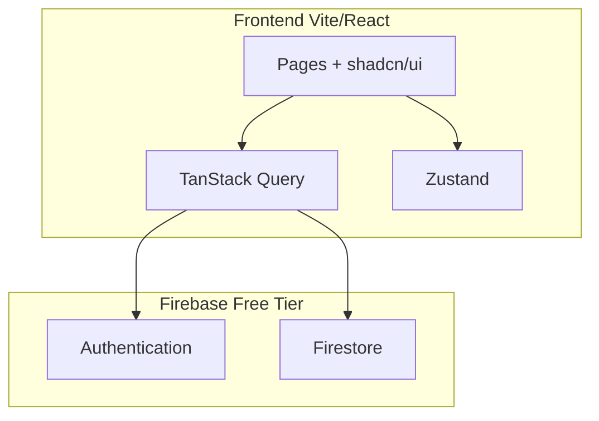

# Especificação — Gestão Financeira Quase-Paróquia Sant'Ana e São Joaquim

> Documento gerado via SDD (Specification-Driven Development).  
> **Status:** aguardando aprovação antes da implementação.  
> **Origem:** [`docs/start-project.md`](../start-project.md) + sessão de refinamento.

---

## 1. Visão geral

Sistema web de gestão financeira e pastoral para a **Quase-Paróquia Sant'Ana e São Joaquim**, com duas camadas de acesso:

| Papel | Descrição |
|-------|-----------|
| **Admin (matriz)** | Gerencia gestores, igrejas, configurações globais e exclusões críticas |
| **Gestor** | Gerencia uma ou mais igrejas vinculadas: dízimos, despesas, tarefas pessoais e perfil |

Deploy manual na **Vercel**. Desenvolvimento local com `npm run dev`.  
**Plano Firebase gratuito** — sem Cloud Functions, sem serviços que exijam cartão de crédito.

---

## 2. Objetivos

- Centralizar dados financeiros (dízimos e despesas) por igreja e consolidado geral
- Oferecer KPIs e alertas in-app para apoiar a gestão pastoral
- Permitir CRUD seguro de igrejas, gestores e dizimistas
- Interface moderna, responsiva e alinhada à identidade visual católica
- Minimizar leituras/gravações no Firestore (free tier)

---

## 3. Restrições e decisões registradas

| Tópico | Decisão |
|--------|---------|
| Login gestores | Firebase Auth — e-mail + senha (conta criada pelo admin) |
| Login admin | Firebase Auth + flag `isAdmin: true` no Firestore |
| Gestor ↔ igrejas | 1 gestor pode gerir **várias** igrejas; seletor de igreja ativa no app |
| Dízimos | Grade mensal: linha por dizimista, colunas Jan–Dez |
| Despesas | Contabilidade completa + recorrentes + referência textual de comprovante (sem upload) |
| Arquivos / fotos | **Sem Firebase Storage** (exige upgrade); avatar por iniciais + URL externa opcional |
| KPIs prioritários | Total dízimos, receita vs despesa, dizimistas inativos, aniversariantes |
| Alertas | Somente in-app (cards no painel central/diário) |
| Falta de dízimo | Configurável pelo admin; **padrão: 2 meses** consecutivos |
| Exclusão igreja | Soft delete → confirmação dupla do admin → hard delete permanente |
| Dizimista ↔ igreja | 1 igreja por vez; transferência permitida |
| Tarefas | Pessoais do gestor (lembretes próprios) |
| Idioma | PT-BR; moeda R$; datas `dd/mm/aaaa` |
| Backend serverless | **Não usar** Cloud Functions na v1 |

---

## 4. Stack tecnológica

### Frontend
- React + Vite + TypeScript
- Tailwind CSS + shadcn/ui
- TanStack Query (server state) + Zustand (UI/local state)
- TanStack Table
- Apache ECharts
- React Hook Form + Zod
- Motion (animações)

### Backend (BaaS)
- Firebase Authentication
- Cloud Firestore
- ~~Firebase Storage~~ **não utilizado** (plano Spark sem billing)

### Estrutura de pastas

```
src/
├── components/
├── pages/
├── layouts/
├── hooks/
├── services/
│   └── firebase/
├── stores/
├── schemas/
├── types/
├── lib/
└── utils/
```

---

## 5. Arquitetura



- Toda lógica de negócio roda no **cliente** + **Firestore Security Rules**
- Agregações pesadas: pré-calcular totais mensais em documentos de resumo (evitar scans completos)
- **Sem upload de arquivos:** avatar via iniciais/cor; foto opcional por URL externa; comprovantes de despesa como referência textual ou link externo

---

## 6. Modelo de dados (Firestore)

### Coleções principais

#### `users/{uid}`
Perfil de autenticação estendido.

| Campo | Tipo | Notas |
|-------|------|-------|
| `email` | string | |
| `displayName` | string | |
| `photoURL` | string? | URL externa opcional (ex.: foto já hospedada); se vazio, avatar com iniciais |
| `avatarColor` | string? | cor de fundo do avatar (hex ou token da paleta) |
| `birthDate` | timestamp? | |
| `isAdmin` | boolean | default `false`; apenas admin matriz |
| `churchIds` | string[] | igrejas vinculadas (gestores) |
| `activeChurchId` | string? | última igreja selecionada |
| `createdAt` / `updatedAt` | timestamp | |

#### `churches/{churchId}`

| Campo | Tipo | Notas |
|-------|------|-------|
| `name` | string | |
| `address` | string? | |
| `isActive` | boolean | soft delete → `false` |
| `deletedAt` | timestamp? | |
| `createdAt` / `updatedAt` | timestamp | |

#### `tithes/{tithesId}` (dizimistas)
ID sugerido: `{churchId}_{slug}` ou auto.

| Campo | Tipo | Notas |
|-------|------|-------|
| `churchId` | string | igreja atual |
| `fullName` | string | |
| `phone` | string? | |
| `birthDate` | timestamp | cálculo de idade/aniversário |
| `isActive` | boolean | |
| `transferredFrom` | string? | igreja anterior |
| `createdAt` / `updatedAt` | timestamp | |

#### `tithes/{tithesId}/donations/{year}`
Subcoleção por ano — grade mensal.

| Campo | Tipo | Notas |
|-------|------|-------|
| `jan` … `dec` | number | valor em centavos (int) |
| `updatedAt` | timestamp | |

> **Otimização:** 1 doc/ano/dizimista = máx. 12 campos numéricos; leitura da grade = 1 doc.

#### `expenses/{expenseId}`

| Campo | Tipo | Notas |
|-------|------|-------|
| `churchId` | string | |
| `category` | string | |
| `subcategory` | string? | |
| `supplier` | string? | |
| `paymentMethod` | string | ex.: dinheiro, pix, cartão |
| `amount` | number | centavos |
| `date` | timestamp | |
| `description` | string? | |
| `receiptReference` | string? | ex.: "NF 1234 — pasta secretaria" |
| `receiptLink` | string? | URL externa opcional (Drive, etc.) |
| `isRecurring` | boolean | |
| `recurrenceRule` | string? | ex.: `monthly`, `yearly` |
| `isActive` | boolean | |
| `createdAt` / `updatedAt` | timestamp | |

#### `tasks/{taskId}` (tarefas pessoais do gestor)

| Campo | Tipo | Notas |
|-------|------|-------|
| `userId` | string | dono da tarefa |
| `churchId` | string? | contexto opcional |
| `title` | string | |
| `dueDate` | timestamp? | |
| `completed` | boolean | |
| `showInDailyPanel` | boolean | aparece no painel central |
| `createdAt` / `updatedAt` | timestamp | |

#### `settings/global`
Configurações da matriz (singleton).

| Campo | Tipo | Notas |
|-------|------|-------|
| `missingDonationMonths` | number | default `2` |
| `updatedAt` | timestamp | |
| `updatedBy` | string | uid admin |

#### `summaries/{churchId}_{year}_{month}` (pré-agregação)
Atualizado no cliente ao salvar dízimos/despesas.

| Campo | Tipo |
|-------|------|
| `churchId` | string |
| `year`, `month` | number |
| `totalDonations` | number |
| `totalExpenses` | number |
| `activeTithesCount` | number |
| `updatedAt` | timestamp |

---

## 7. Autenticação e autorização

### Fluxos

1. **Admin:** login Firebase Auth → app lê `users/{uid}.isAdmin === true`
2. **Gestor:** admin cria usuário (e-mail, nome, igrejas) → gestor define/usa senha via Firebase Auth
3. **Bootstrap admin:** script/seeding local (não versionado) cria conta admin inicial; credenciais **somente em `.env` local**, nunca no repositório

### Matriz de permissões

| Ação | Admin | Gestor |
|------|:-----:|:------:|
| CRUD gestores | ✅ | ❌ |
| CRUD igrejas | ✅ | ❌ |
| Ver/editar igrejas vinculadas | ✅ | ✅ |
| CRUD dizimistas (suas igrejas) | ✅ | ✅ |
| Lançar dízimos / despesas | ✅ | ✅ |
| Transferir dizimista | ✅ | ✅ |
| Config. alertas globais | ✅ | ❌ |
| Soft/hard delete igreja | ✅ | ❌ |
| Tarefas pessoais | ✅ | ✅ (próprias) |
| Editar próprio perfil | ✅ | ✅ |

### Firestore Security Rules (diretrizes)
- Leitura/escrita condicionada a `request.auth != null`
- Admin: `get(/users/$(uid)).isAdmin == true`
- Gestor: `churchId in get(/users/$(uid)).churchIds`
- Gestor só acessa `tasks` onde `userId == request.auth.uid`
- Writes em `settings/global` apenas admin

---

## 8. Módulos funcionais

### 8.1 Layout e navegação

- **Header:** logo/nome paróquia, seletor de igreja ativa (gestores multi-igreja), avatar circular (canto superior direito)
- **Menu:** abas principais — Dashboard, Igrejas (admin), Dízimos, Despesas, Tarefas, Configurações (admin)
- **Painel central/diário:** cards minimizáveis — aniversários, alertas de dízimo, tarefas do dia
- **Responsivo:** mobile-first; sidebar colapsável em notebook/celular

### 8.2 Dashboard (aba principal)

- Gráficos ECharts: dízimos por mês, receita vs despesa, comparativo entre igrejas (admin)
- Filtros: igreja, período (mês/ano), categoria
- Barra de busca por palavras-chave (dizimistas, despesas, igrejas)
- KPIs: totais, saldo, inativos, aniversariantes

### 8.3 Gestão de igrejas (admin)

- CRUD básico com validações
- **Soft delete:** marca `isActive: false`; dados preservados
- **Hard delete:** modal de confirmação dupla (digitar nome da igreja) → remove docs relacionados
- Vincular/desvincular gestores (`churchIds`)

### 8.4 Gestão de gestores (admin)

- Criar perfil: e-mail, nome, igrejas vinculadas
- Integração Firebase Auth (createUser ou fluxo de convite manual na v1)
- Listagem com status ativo/inativo

### 8.5 Dízimos

- Lista de dizimistas por igreja ativa
- CRUD dizimista: nome, telefone, data nascimento, igreja
- **Grade anual:** tabela Jan–Dez editável inline
- Transferência de igreja com histórico (`transferredFrom`)
- Export visual (fase futura; não bloqueia MVP)

### 8.6 Despesas

- Formulário completo (categoria, subcategoria, fornecedor, forma pagamento, valor, data, descrição)
- Despesas recorrentes: flag + regra simples
- Referência de comprovante: campo texto + link externo opcional (sem upload)
- Listagem com TanStack Table + filtros

### 8.7 Tarefas pessoais

- CRUD tarefas do gestor logado
- Agendamento com `dueDate`
- Toggle `showInDailyPanel` para cards no painel central

### 8.8 Perfil do usuário

- Página de edição: nome, senha (Firebase reauth), cor do avatar, URL de foto opcional, data nascimento
- Avatar no header: iniciais do nome ou imagem se `photoURL` válida
- Salvar → retorna à página anterior

### 8.9 Alertas in-app

| Alerta | Regra |
|--------|-------|
| Dízimo ausente | Dizimista ativo sem valor nos últimos N meses (`settings/global.missingDonationMonths`) |
| Aniversário | `birthDate` nos próximos 7 dias |
| Tarefa | `dueDate` hoje ou atrasada + `showInDailyPanel` |

Cards minimizáveis; estado de minimizado em `localStorage` (Zustand).

---

## 9. UI/UX

### Identidade visual
- Cores: bege, dourado, branco, vermelho, acentos azuis (paleta católica)
- Glassmorphism em cards e modais
- Modais arrastáveis (drag)
- Tipografia legível; contraste acessível (WCAG AA onde possível)

### Componentes shadcn/ui
- Button, Input, Dialog (draggable wrapper), Table, Select, Tabs, Avatar, Card, Toast

### Responsividade
- Breakpoints: mobile `<640px`, tablet `640–1024px`, desktop `>1024px`
- Tabelas: scroll horizontal ou layout empilhado no mobile
- Gráficos: altura adaptável

---

## 10. Otimização Firebase (free tier)

| Estratégia | Detalhe |
|------------|---------|
| Docs de resumo | `summaries/` atualizados no write; dashboard lê resumos, não coleções inteiras |
| Subcoleção por ano | Grade de dízimos: 1 read por dizimista/ano |
| Paginação | TanStack Table com `limit` + cursor Firestore |
| Cache | TanStack Query `staleTime` generoso; invalidação targeted |
| Sem Storage | Evita billing; dados 100% em Firestore |
| Índices | Criar apenas compostos necessários (churchId + date, etc.) |
| Listeners | Preferir fetch on demand; realtime só onde crítico |

**Limites a monitorar:** 50k reads/dia, 20k writes/dia.

---

## 11. Variáveis de ambiente

Arquivo `.env.local` (nunca commitado):

```env
VITE_FIREBASE_API_KEY=
VITE_FIREBASE_AUTH_DOMAIN=
VITE_FIREBASE_PROJECT_ID=
VITE_FIREBASE_MESSAGING_SENDER_ID=
VITE_FIREBASE_APP_ID=

# Bootstrap local apenas (script seed admin — não expor no frontend bundle)
FIREBASE_ADMIN_EMAIL=
FIREBASE_ADMIN_PASSWORD=
```

> As credenciais de admin **não** ficam hardcoded no código. O frontend usa apenas variáveis `VITE_*`.

---

## 12. Deploy

1. Build: `npm run build`
2. Vercel: importar repo, framework Vite, env vars configuradas
3. Firebase: adicionar domínio Vercel em Auth → Authorized domains
4. Deploy manual via CLI ou dashboard Vercel

---

## 13. Checklist Firebase (o que você precisa fazer/fornecer)

Como seu projeto está **parcialmente criado**, complete:

- [ ] **Authentication** → ativar provedor **E-mail/Senha**
- [ ] **Firestore** → criar banco (modo produção); região `southamerica-east1` (São Paulo) se disponível
- [ ] **Storage** → **não ativar** (não necessário na v1)
- [ ] **Console → Project settings → Your apps** → registrar app Web → copiar config
- [ ] Enviar/copiar para `.env.local` as chaves `VITE_FIREBASE_*`
- [ ] **Authentication → Settings → Authorized domains** → adicionar `localhost` e domínio Vercel
- [ ] Publicar **Firestore Rules** (fornecidas na implementação)
- [ ] Criar índices compostos quando o console solicitar (links automáticos nos erros)
- [ ] Executar script de seed do admin (implementação) para criar 1º usuário com `isAdmin: true`

**Não é necessário na v1:** Cloud Functions, Blaze plan, billing.

---

## 14. Critérios de aceite (v1)

- [ ] Admin faz login e acessa painel de gestores e igrejas
- [ ] Admin cria gestor com e-mail e vincula igrejas
- [ ] Gestor faz login, seleciona igreja ativa, vê dashboard filtrado
- [ ] CRUD dizimistas com grade Jan–Dez funcional
- [ ] CRUD despesas com referência de comprovante e recorrentes
- [ ] KPIs e gráficos refletem dados reais
- [ ] Alertas in-app: dízimo ausente (N meses configurável), aniversários, tarefas
- [ ] Soft delete + hard delete de igreja com confirmação dupla
- [ ] Perfil: editar nome, senha, avatar (iniciais/cor/URL opcional), data nascimento
- [ ] Layout responsivo em mobile e notebook
- [ ] App roda com `npm run dev`; build pronto para Vercel

---

## 15. Fora de escopo (v1)

- Firebase Storage (upload de fotos/comprovantes)
- Cloud Functions / triggers server-side
- E-mail, WhatsApp ou push notifications
- Relatórios PDF/Excel export
- Multi-idioma
- Auditoria completa (log de alterações) — pode ser v2

---

## 16. Próximos passos

1. **Você revisa e aprova esta spec**
2. Implementação do projeto (scaffold + Firebase + módulos)
3. Você fornece config Firebase e testa localmente
4. Deploy manual Vercel

---

## Apêndice A — Referência rápida de abas

| Aba | Admin | Gestor |
|-----|:-----:|:------:|
| Dashboard | ✅ | ✅ |
| Igrejas | ✅ | — |
| Gestores | ✅ | — |
| Dízimos | ✅ | ✅ |
| Despesas | ✅ | ✅ |
| Tarefas | ✅ | ✅ |
| Configurações | ✅ | — |
| Editar perfil | ✅ | ✅ |
